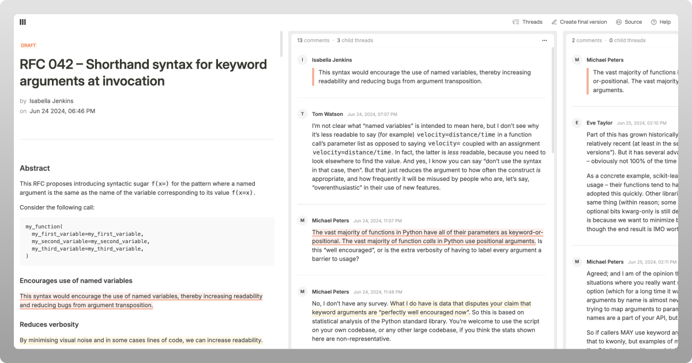

CQ2 is a tool for RFCs, designed for thoughtfulness and coherence. [Learn more](https://cq2.co).

## My Fork

- [ ] Switch mongo db to postgres. 
- [ ] Tiptap @mentions
- [ ] Currently, we can only create 2 version - Draft and Final. Try to make `n` number of version based on the author. 
- [ ] Version comparison
- [ ] Abiility to the chat to PDF, 

## License

CQ2 is distributed under the AGPLv3 [license](https://github.com/anandbaburajan/cq2/blob/main/LICENSE).
